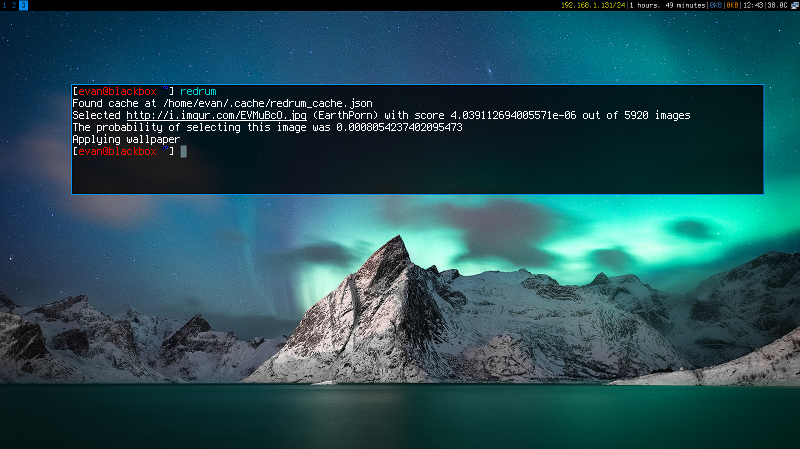

Redrum - Reddit Wallpaper Downloader and Ranker
==============================================

Redrum is a Reddit wallpaper downloader which scores wallpapers and selects the best based on resolution, aspect ratio, and number of views.  It remembers which wallpapers were selected previously so you never see the same image twice.

Install the systemd units to run the script every two hours.

Installation
------------

1. Install through pip

   .. code:: bash

      pip3 install redrum
  
2. Install systemd user unit (optional)

   .. code:: bash

      # copy service files
      cp -u systemd/* ~/.config/systemd/user/

      # enable and start systemd timer
      systemctl --user enable redrum.timer
      systemctl --user start redrum.timer

      # the service can be triggered manually as well
      systemctl --user start redrum

   note: If using a python3 virtualenv, change ``ExecStart`` in ``redrum.service`` to ``/path/to/venv/bin/redrum``
  
Usage
-----

If redrum can't find a config file, it will create one in ``~/.config/redrum.ini`` automatically.  You should update this file with your screen resolution and preferred subreddits, then run redrum again.

.. code:: bash

   >>> redrum
   No config found at /home/evan/.config/redrum.ini.  Creating...
   Update config with your preferred options and run redrum again.

   >>> redrum
   No previous score cache found at /home/evan/.cache/redrum_cache.json.
   Indexing page #0 from subreddit winterporn
   Indexing page #1 from subreddit winterporn
   Indexing page #2 from subreddit winterporn
   ...
   Selected http://i.imgur.com/3UWbcYG.jpg (EarthPorn) with score 5.21729920261845e-05 out of 5971 images
   The probability of selecting this image was 0.009851421028579594
   Applying wallpaper

Scoring algorithm
-----------------

Images are scored in three steps as follows:

1. Three input scores are calculated for each image in the cache

   .. math::

      pixel_score = [total image pixels] / [total screen pixels]
   
      ratio_score = [image x-y ratio] / [screen x-y ratio]
                                    or
                    [screen x-y ratio] / [image x-y ratio]
                            (whichever is less than 1)
                         
      views_score = [# views of this image] / [highest # views of all images]
   
2. Each input score is run through a sigmoid function, in this case, the `logistic function`_.  This helps to provide stronger differentiation between a good and a bad image than could be afforded with a linear method.  The logistic function is defined by its ``midpoint`` (x0) and the slope at the midpoint, ``k``. 

   .. image:: https://wikimedia.org/api/rest_v1/media/math/render/svg/2770ecdecd1a6d2375d17f73013905cea5fb2668
   .. figure:: https://upload.wikimedia.org/wikipedia/commons/8/88/Logistic-curve.svg
      :width: 400px
   
      Logistic function with ``midpoint=0``, ``k=1``

   .. math::

      ratio_logistic_score = 1/(1 + pow(math.e, -ratio_k * (ratio_score - ratio_cutoff)))
      views_logistic_score = 1/(1 + pow(math.e, -views_k * (views_score - views_cutoff)))
      pixel_logistic_score = 1/(1 + pow(math.e, -pixel_k * (pixel_score - pixel_cutoff)))
   
   ``pixel_score``, ``ratio_score``, and ``views_score`` each have their own ``midpoint`` and ``k``, which can be set in ``~/.config/redrum.ini``

   .. _logistic function: https://en.wikipedia.org/wiki/Logistic_function
   
3. The three logistic scores are then multiplied to calculate an image's ``final_score``.  This score is used to do a random weighted select of all images in the cache.  An image with a ``final_score`` that is twice the score of another image is twice as likely to be selected during the random selection.

Tuning the scoring algorithm
----------------------------
You can easily adjust the scoring algorithm if you aren't satisfied with the images being selected.  ``redrum/tune.py`` allows you to quickly adjust the ``midpoint`` and ``k`` of the logarithmic function and view its effects on the ``final_score``.

  
  
